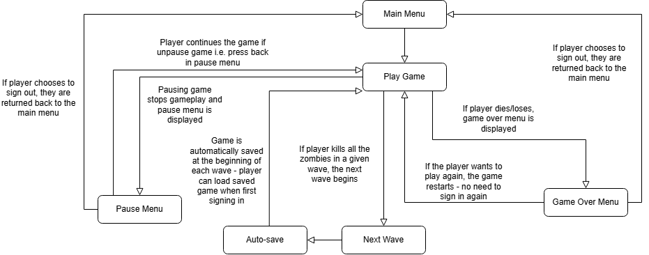
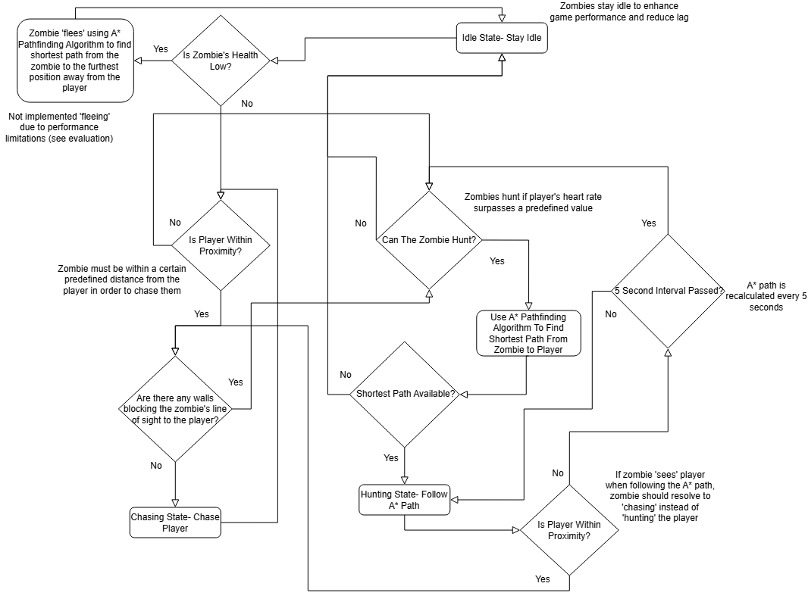
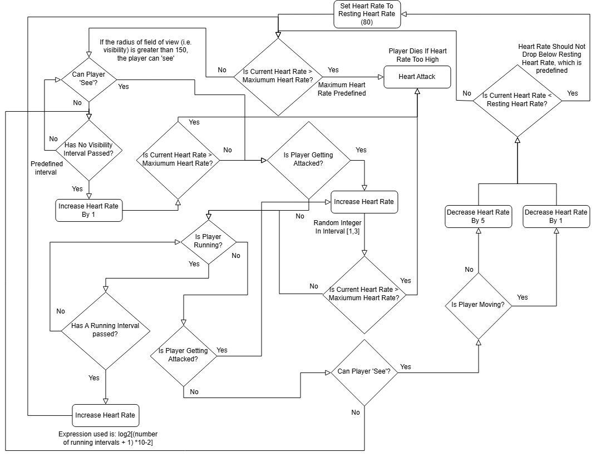

<p align="center">
  
</p>

## Executive Summary

DEAD PULSE is a top-down post-apocalyptic survival shooter built in Python using Pygame. The game puts players into an escalating survival environment where success depends on balancing physical combat with complex internal resource systems (biometric stress, flashlight power, ammo, and stamina).  

Rather than relying on static difficulty curves, DEAD PULSE utilises an infinite wave progression engine. Difficulty, enemy behavior, and weapon stability scale dynamically based on player performance and physiological stress metrics. It combines stress-driven enemy AI, adaptive wave scaling and interconnected resource management systems to create a survival experience where player state directly influences enemy behaviour.

## Gameplay Demo


## Key Features
1. **Adaptive Enemy AI & State Management**
    - **Stress-Driven AI Pathfinding:** Zombies do not blindly run $A^*$ pathfinding every frame (which would cause CPU bottlenecks). Instead, enemy behavior is governed by a Biometric Finite State Machine (FSM)
    - **Grid-Aligned Passive State vs. Unconstrained Chase:** 
        - When **idle or not actively chasing**, zombies automatically snap back and align to the discrete grid block system for efficient spatial orientation and performance optimisation
        - When **actively chasing**, enemies break free from strict grid snapping, unlocking continuous, unconstrained float-coordinate movement directly toward the player while navigating along calculated $A^*$ waypoint paths
    - **Dynamic Hunter Allocation:** The engine evaluates player heart rate in real time. When stress crosses the critical threshold, the engine identifies and flags the top $N$ closest zombies to the player as *active Hunters*
    - **Dedicated $A^*$ Execution:** Only designated *Hunter* entities execute $A^*$ pathfinding to track the player through complex map terrain when the player's heartrate exceeds a certain threshold
    - **Line of Sight & Direct Pursuit:** If an entity has a clear, un-blocked line-of-sight to the player, $A^*$ is bypassed for direct vector pursuit, minimising computational overhead

2. **Biometric Heart Rate Mechanics**:
    - Simulates dynamic physiological stress. Sprinting, staying in pitch darkness, or taking damage elevates the player's heart rate using a **logarithmic growth formula** $f(x) = \log_2(x+1) \cdot 10 - 2$ to prevent instant, unfair spikes while applying smooth pressure
    - Excessive heart rates ($\ge 250\text{ BPM}$) result in a fatal heart attack (Game Over). High heart rates also scale weapon accuracy spread dynamically using trigonometric calculations

3. **Dynamic Time Allocation & Adaptive Wave Scaling**:
    - Wave difficulty scales dynamically based on a custom **Performance Factor Score**:
    $$\text{Wave Performance} = 1.0 + (\text{Time Factor} \times W_{\text{time}}) + (\text{Accuracy} \times W_{\text{acc}}) + (\text{Health Retained} \times W_{\text{health}})$$
    - Next-wave parameters - including total zombie counts, Walker/Runner/Brute ratios, zombie health/attack multipliers, and dynamic wave countdown timers - adapt directly to match the player's skill level.


4. **Black Market Economy via CoinGecko Bitcoin API**:
    - Features an in-game shop (*"Dead Man's Deals"*) where players purchase stat upgrades, ammo, and torchlight batteries using collected **Rotten Flesh**
    - Prices fluctuate dynamically in real time by fetching current **BTC to GBP conversion rates** via the **CoinGecko REST API**, introducing market volatility to resource management


5. **Comprehensive Persistence & High-Score Systems**:
    - User profile authentication validated via Regular Expressions (`re`)
    - Full JSON state persistence handling mid-run game saves, lifetime player statistics tracking, performance analytics tables, and local leaderboard management

## A* Pathfinding Algorithm
The pseudocode below represents the A* pathfinding algorithm used by the zombies to find the shortest path to the player when the player’s heart rate surpasses a certain threshold. It uses a priority queue (open_set) to always explore the lowest-cost path first and calculates the optimal route using a heuristic, Euclidean distance, and movement cost. Diagonal movement is weighted by √2 for realism and accuracy. Helper functions such as Get_Neighbours() and Calculate_Heuristic() are abstracted, demonstrating modular design. 

```text
Algorithm A_Star (start, goal):
    open_set ← empty priority queue
    // list of nodes that should be checked
    closed_set ← empty set
    // stores nodes that have already been checked

    Create start_node with coordinates of start
    Push start_node into open_set with priority 0

    nodes ← dictionary mapping (x,y) to Node objects
    nodes[start] ← start_node

    WHILE open_set is not empty:
        current_node ← node in open_set with lowest f value
        IF current_node == goal:
            RETURN Reconstruct_Path(current_node)

        Add current_node to closed_set

        FOR each neighbour in Get_Neighbours(current_node):
            IF neighbour is in closed_set:
                CONTINUE
        
            tentative_g ← current_node.g + grid_size
            // calculated cost of reaching neighboring node from current node
            IF neighbour not in nodes:
                IF neighbour.g is diagonal:
                    neighbour.g ← tentative_g x √2
                ELSE:
                    neighbour.g ← tentative_g

                neighbour.h ← Calculate_Heuristic(neighbour, goal)
                //.h is heuristic (estimated) cost to goal
                neighbour.f ← neighbour.g + neighbour.h
                //.f is total cost 
                
                neighbour.parent ← current_node

                Push neighbour into open_set with priority neighbour.f
                Add neighbour to nodes

    RETURN empty list (no path found)
```

## High-Level Game Flow Diagram
The diagram below provides a high-level overview of the core game flow in DEAD PULSE. Abstracting detailed mechanics and individual menu options, it highlights the primary states of the game: the main menu, gameplay, pause menu, next wave, auto-save, and game over menu. More detailed flowcharts are later used to break down specific aspects of the program.




## Zombie AI Behaviour Breakdown
The following diagram provides a detailed breakdown of the zombie AI behaviour in DEAD PULSE. It illustrates the decision-making process that governs how zombies locate and chase the player.

The AI switches between different states depending on whether the zombie has a clear line of sight of the player and if the player is within proximity. If the player is out of sight, the zombies utilise the A* Pathfinding algorithm to navigate towards the player’s last known location. When the player becomes visible and within range, the zombie switches to direct chasing behaviour.



## Heart Rate Logic Breakdown
The following diagram provides a detailed breakdown of the heart rate mechanic in DEAD PULSE. It illustrates how the player’s heart rate is dynamically influenced by external factors such as taking damage from zombies, experiencing impaired vision and sprinting.

When these factors occur, the heart rate increases dynamically and gradually returns to normal resting heart rate when the player is no longer in immediate danger. Prolonged exposure to these factors keeps the heart rate elevated, adding tension and encouraging strategic decision-making.



## Tech Stack & Dependencies

| Domain | Technology / Library | Usage |
| :--- | :--- | :--- |
| **Language** | Python 3.12 | Core application logic |
| **Engine** | Pygame | Graphics, sound, event handling, sprite rendering |
| **UI Framework**| Pygame-menu | Dynamic main menu, settings, shop, and leaderboards |
| **Pathfinding** | `heapq`, `math` | Binary heap priority queues for A\* pathfinding |
| **Networking** | Requests | Fetching live financial market data from CoinGecko API |
| **Data Parsing** | JSON / Regex | Config, map geometry storage, stats persistence, input validation |


## Controls & Gameplay Guide

| Action | Control | Notes |
| :--- | :--- | :--- |
| **Move Up / Down** | `W` / `S` | Rebindable in Settings |
| **Move Left / Right** | `A` / `D` | Rebindable in Settings |
| **Sprint** | `Left Shift` | Speed up, but drastically increases heart rate |
| **Aim / Turn** | Mouse Movement | Rotates character towards cursor |
| **Shoot** | `Space` | Fires weapon (subject to heart rate spread) |
| **Pause / Shop** | `ESC` | Access Pause Menu, Settings, and Black Market |

## Technical Architecture

| Library / Module | Purpose |
| :--- | :--- | 
| **pygame** | Core library used for rendering graphics, managing sprite groups and behaviour, handling audio and keyboard inputs. Forms the foundation of all 2D gameplay features |
| **pygame_menu** | Allows for creation of in-game menus, used for managing game options such as starting a new game, adjusting settings and navigating between menus |
| **math** | Allows for the use of mathematical operations such as trigonometric functions (atan2, cos, sin etc.), used for shooting direction, bullet spread, sprite rotations and other geometric calculations |
| **json** | Allows reading and writing to and from JSON files, such as saving game state, player stats and reading map data i.e. walls and rooms - enables a data-drive program architecture |
| **heapq** | Used to implement an efficient priority queue for the A* pathfinding, leading to O(log n) performance when choosing optimal nodes |
| **re** | Used for regular expression operation - validating an entered username |
| **sys** | Enables interaction with the Python interpreter, allowing for the exiting of the program |
| **requests** | Used to fetch real-time data from external coingecko API to allow for the integration of real-world volatile pricing into gameplay |


# Installation

## Prerequisites

- Python 3.10 or later
- `pip`

## 1. Clone the repository

```bash
git clone https://github.com/Ali-Kamaly/Dead-Pulse.git
cd Dead_Pulse
```
## 2. Install the required dependencies

```bash
pip install -r requirements.txt
```

## 3. Launch the game

```bash
python main.py
```